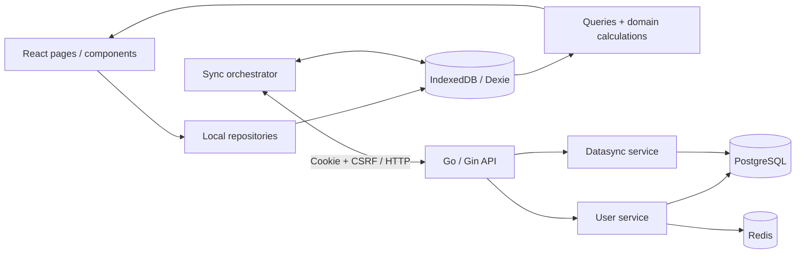
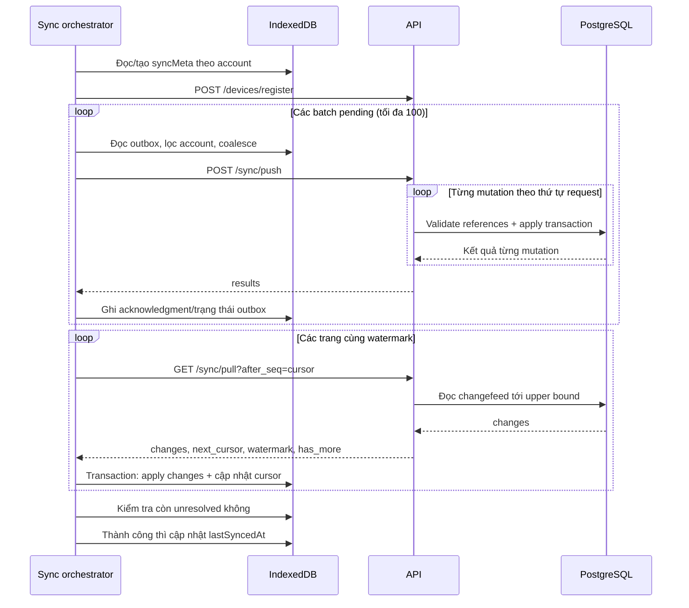

# Vehicle Care — Hệ thống và luồng nghiệp vụ hiện tại

> Đối chiếu trực tiếp working tree ngày 23/09/2026, bao gồm các thay đổi đang dev.
> Đây là mô tả **implementation hiện tại**. Các điểm cần sửa và phương án thiết kế tiếp theo nằm trong [bản review](./structure-sync-review.md).

## 1. Hệ thống giải quyết bài toán gì?

Ứng dụng giúp một tài khoản quản lý nhiều xe, ghi số kilomet, lần đổ xăng, lần bảo dưỡng, cấu hình chu kỳ bảo dưỡng và xem lịch sử/chi phí. Dữ liệu được đồng bộ giữa các thiết bị cùng tài khoản.

Mô hình chính là **local-first, đồng bộ eventual consistency**:

- UI đọc dữ liệu từ IndexedDB trên thiết bị.
- Thao tác nghiệp vụ ghi local trước, đồng thời tạo mutation trong outbox.
- Sync đẩy mutation lên server rồi kéo thay đổi về; không yêu cầu realtime.
- PostgreSQL giữ trạng thái đã được server chấp nhận và thứ tự thay đổi theo tài khoản.
- Không thể xem dữ liệu vừa lưu local là đã được sao lưu lên server cho đến khi sync thành công.

**Giới hạn quan trọng:** session hiện tại vẫn phải được xác minh online mỗi lần mở app. Mở lại khi mất mạng bị chuyển về đăng nhập, dù IndexedDB còn dữ liệu. Vì vậy local-first đã có ở tầng dữ liệu nhưng trải nghiệm cold-start offline chưa hoàn chỉnh.

## 2. Các thành phần và trách nhiệm



### Frontend

| Thư mục | Trách nhiệm |
|---|---|
| `client/src/pages`, `components` | Giao diện, nhập liệu, gọi repository |
| `client/src/routes` | Điều hướng và chặn route khi chưa đăng nhập |
| `client/src/domain` | Types và các hàm tính toán/validation thuần |
| `client/src/data/repositories` | Ghi entity + enqueue mutation trong cùng local transaction |
| `client/src/data/queries` | Đọc và tổng hợp dữ liệu cho UI |
| `client/src/hooks` | Kết nối React với live queries của Dexie |
| `client/src/data/db.ts` | Schema IndexedDB và migration local |
| `client/src/data/outbox.ts` | Hàng đợi mutation và trạng thái xử lý |
| `client/src/sync` | Bootstrap, push, pull, áp dụng snapshot, auto-sync |
| `client/src/api` | HTTP client, DTO, lỗi API |
| `client/src/stores` | Trạng thái session/sync của UI; không phải nơi giữ toàn bộ entity |

### Backend

| Thư mục | Trách nhiệm |
|---|---|
| `server/cmd/api` | Đọc config, lắp dependency, chạy HTTP server, graceful shutdown |
| `server/cmd/migrate` | Chạy migration riêng |
| `server/internal/application/user` | Signup/login, session, token, đăng ký thiết bị |
| `server/internal/application/datasync` | Validate và điều phối push/pull |
| `server/internal/domain` | Mô hình dữ liệu dùng giữa application và adapters |
| `server/internal/adapters/httpapi` | Gin routes, cookie, CSRF, CORS, HTTP errors |
| `server/internal/adapters/postgres` | Transaction, entity persistence, sequence, changefeed, dedupe |
| `server/internal/adapters/redis` | Session, token và OAuth-state storage |
| `server/internal/platform` | Config và logging |
| `server/db/queries`, `db/migrations` | SQL nguồn và schema; sqlc sinh code trong adapter |

Port hiện được đặt tại `application/user/port.go` và `application/datasync/port.go`; không có tầng `internal/ports` như một số tài liệu cũ mô tả. `Datasource` tại composition root ghép Postgres và Redis để cung cấp dependency cho application.

## 3. Mô hình dữ liệu nghiệp vụ

| Entity | Phạm vi | Hành vi thực tế |
|---|---|---|
| Account | Một người dùng | Email/password hash, tên, timezone, email verification |
| Device | Theo account | Định danh installation để đăng ký và dedupe push |
| Vehicle | Theo account | Sửa tên/biển số/ngưỡng cảnh báo; archive/restore; tombstone khi xóa |
| PartType | Theo account | Danh mục phụ tùng riêng; thêm/sửa/tắt; seed 10 dòng lúc signup |
| ReminderConfig | Theo xe và phụ tùng | Chu kỳ KM/ngày, mốc ban đầu, enabled, tombstone |
| OdometerLog | Theo xe | **Append-only**; chỉ tạo, không sửa/xóa |
| FuelLog | Theo xe | **Mutable**; sửa/xóa mềm, có thể liên kết OdometerLog |
| ServiceLog | Theo xe và phụ tùng | **Mutable**; sửa/xóa mềm; dùng để suy ra mốc bảo dưỡng |

FuelLog và ServiceLog đã cho sửa/xóa, khác quyết định append-only ở tài liệu MVP ban đầu. Các entity mutable sync bằng snapshot toàn bản ghi, không phải patch từng field.

Các dữ liệu suy ra, không lưu như một nguồn sự thật thứ hai:

- KM hiện tại: suy ra từ OdometerLog.
- Lần bảo dưỡng gần nhất: suy ra từ ServiceLog chưa xóa của xe/phụ tùng.
- Trạng thái nhắc bảo dưỡng: tính từ chu kỳ, mốc ban đầu, log và thời gian hiện tại.
- Chi phí: tổng hợp FuelLog/ServiceLog.

Một cặp `(account, vehicle, part type)` chỉ có một ReminderConfig chưa tombstone. `enabled=false` vẫn chiếm cặp này; “active” trong unique constraint có nghĩa là **chưa xóa**, không phải đang bật.

## 4. Đăng ký, đăng nhập và khởi động app

### 4.1. Đăng ký

1. Client gửi email/password/name tới `POST /auth/signup`.
2. Server validate, chuẩn hóa email, hash password bằng bcrypt.
3. Một PostgreSQL transaction tạo account, dòng account sequence và 10 PartType riêng cho account.
4. Server tạo verification token và session trong Redis.
5. HTTP response đặt cookie `sid` (HttpOnly) và `csrf_token` (JS đọc được).
6. Client xác định account qua session và lấy danh mục phụ tùng để dùng trong picker.

Các bước PostgreSQL và Redis không nằm trong một distributed transaction. Nếu tạo session/token lỗi sau khi tạo account, account vẫn đã tồn tại.

Verification/reset token có storage nhưng chưa có luồng gửi email thật. Signup đã tạo phiên đăng nhập ngay, không chờ xác minh email. Google sign-in chưa implement.

### 4.2. Đăng nhập và mở lại app

- Login xác thực password, tạo session/CSRF token rồi đặt cookie.
- `App.tsx` gọi `hydrate()` → `GET /auth/session`.
- Thành công: cập nhật Zustand session, tải PartType best-effort, khởi động auto-sync.
- Thất bại bất kỳ, kể cả mất mạng hoặc lỗi server: đặt `anonymous`; `RequireAuth` chuyển về `/sign-in`.
- `accountCache` trong Dexie hiện được ghi lúc bootstrap sync nhưng chưa dùng để khôi phục truy cập offline.

Logout gọi API xóa session rồi clear session UI. Nếu API lỗi, client vẫn clear UI. Dữ liệu IndexedDB không bị xóa bởi thao tác này.

## 5. Luồng nghiệp vụ trên thiết bị

### 5.1. Thêm, sửa, ẩn và xóa xe

1. Người dùng nhập tên và biển số tùy chọn.
2. Repository sinh UUID, tạo Vehicle với `serverSeq=null`.
3. Transaction Dexie ghi Vehicle và outbox mutation `create`.
4. Live query cập nhật giao diện ngay.
5. Sửa xe tạo snapshot mới và mutation `update` trong cùng transaction.

`archivedAt` ẩn xe và có thể restore. `deletedAt` là tombstone. Xóa xe không tự xóa vật lý các log/reminder con; những query kiểm tra xe đã xóa sẽ ẩn dữ liệu tương ứng.

### 5.2. Danh mục phụ tùng

- Mỗi account có UUID PartType riêng, không dùng UUID chung cho tất cả người dùng.
- Seed mặc định có `server_seq=0` và **không được append vào changefeed**.
- Client lấy chúng qua `GET /part-types` → `refreshPartTypesFromServer()`.
- Những thay đổi PartType sau đó đi qua push/pull như entity mutable khác.
- Custom PartType có `code` bằng ID; seed PartType dùng code như `engine_oil`.
- PartType inactive không được chọn cho reminder/service mới. Update giữ nguyên reference cũ có thể được chấp nhận dù phụ tùng đã inactive.

Đây là ngoại lệ của kiến trúc hiện tại: dữ liệu phụ tùng đi qua cả catalog fetch lẫn sync. Chỉ chạy pull từ cursor 0 chưa đủ để khôi phục các seed row chưa từng sửa.

### 5.3. Cấu hình nhắc bảo dưỡng

1. Chọn xe và PartType active.
2. Nhập ít nhất một chu kỳ: KM hoặc số ngày.
3. Nhập mốc KM/ngày ban đầu để dùng khi chưa có lịch sử bảo dưỡng tương ứng.
4. Repository kiểm tra ownership, phụ tùng và trùng cấu hình.
5. Ghi ReminderConfig + outbox trong một transaction.

Implementation cho phép baseline null; khi không đủ mốc tính toán, domain có thể trả `insufficient_data`. Không có một field mutable “lần thay gần nhất” trong ReminderConfig.

### 5.4. Ghi KM

Mỗi lần nhập tạo một OdometerLog mới. Cho phép KM thấp hơn hiện tại, với cảnh báo ở luồng nhập liệu; không nội suy KM giữa các log.

Cách chọn KM hiện tại trong code:

1. Chọn `recordedAt` mới nhất.
2. Nếu bằng nhau và cả hai có `receivedAtServer`, chọn timestamp nhận mới hơn.
3. Nếu chỉ một log đã sync, log đã sync được ưu tiên.
4. Nếu cả hai chưa sync, dùng thứ tự phần tử đầu vào.

Điểm 2–4 chưa phải total ordering bền vững: UUID không biểu diễn thứ tự tạo; đề xuất chuyển tie-break sang `serverSeq`/local sequence nằm trong bản review.

### 5.5. Ghi đổ xăng

- Có thể nhập thời gian, lượng xăng, tiền, nơi đổ, ghi chú, đầy bình và KM tùy chọn.
- Không nhập KM: tạo một FuelLog và một mutation.
- Có nhập KM: tạo OdometerLog trước, FuelLog tham chiếu ID đó, rồi ghi **hai entity + hai mutation trong cùng local transaction**.
- Server vẫn áp dụng từng mutation bằng transaction riêng, nên cặp Fuel/Odometer không atomic trên server.
- Sửa/xóa FuelLog không sửa/xóa OdometerLog đã tạo kèm. Đổi thời gian FuelLog cũng không tự đổi `recordedAt` của OdometerLog.

### 5.6. Ghi bảo dưỡng

1. Chọn xe/phụ tùng, thời gian, KM snapshot, chi phí và ghi chú.
2. Tạo ServiceLog + mutation.
3. Query reminder lấy lại ServiceLog mới nhất và tính lại mốc bảo dưỡng.
4. Không update ReminderConfig để reset chu kỳ.

KM snapshot trên ServiceLog không tạo thêm OdometerLog. Sửa/xóa ServiceLog có thể thay đổi mốc reminder; xóa bản mới nhất có thể làm bản cũ hơn trở thành mốc được dùng.

### 5.7. Tính trạng thái reminder

Hàm thuần: `client/src/domain/reminder.ts::calculateReminderStatus`.

```text
baselineKm   = KM của service mới nhất nếu có, nếu không lấy baseline config
baselineDate = ngày service mới nhất theo timezone account, nếu không lấy baseline config
usedKm       = max(0, currentKm - baselineKm)
usedDays     = max(0, khoảng cách ngày lịch từ baselineDate đến hôm nay)
remaining    = interval - used
```

Thứ tự quyết định:

1. Mọi điều kiện đã cấu hình đều thiếu dữ liệu → `insufficient_data`.
2. Có ít nhất một điều kiện `remaining <= 0` → `overdue`.
3. Có ít nhất một điều kiện `used / interval >= dueSoonRatio` → `due_soon`.
4. Còn lại → `not_due`.

Mặc định `dueSoonRatio=0.9`: đã dùng 90%, tức còn 10% chu kỳ. Xe có thể override ngưỡng. Đây là **tỷ lệ đã dùng**, dù tên constant hiện tại là `DUE_SOON_REMAINING_RATIO`. Một chiều thiếu dữ liệu không ngăn đánh giá chiều còn lại.

Nếu service mới nhất không có KM, chiều KM fallback về baseline config, không tìm service cũ gần nhất có KM. Đây là hành vi hiện tại cần chốt lại về nghiệp vụ.

Tính ngày theo timezone account. Hook hiện dùng live query theo dữ liệu; chưa có trigger riêng để tính lại khi qua nửa đêm mà dữ liệu không đổi.

### 5.8. Lịch sử và chi phí

- History gộp FuelLog và ServiceLog chưa xóa, sort theo thời điểm nghiệp vụ.
- Chi phí tháng nhóm theo tháng lịch trong timezone account.
- Chi phí/KM tham khảo dùng log trong cửa sổ gần đây và chênh lệch `max(KM)-min(KM)`.
- **Lỗi hiện tại:** query chi phí chưa lọc `deletedAt`; log đã biến mất khỏi History vẫn bị tính vào chi phí.

## 6. Vòng đời một lần sync

### 6.1. Khi nào chạy?

- Người dùng bấm đồng bộ thủ công.
- Auto-sync kiểm tra lúc khởi động, thay đổi session, trở lại foreground hoặc có mạng.
- Chỉ chạy tự động khi authenticated, online, tab visible và lần thành công gần nhất cách hơn 15 phút.
- Có timer để kiểm tra lại khi tab vẫn mở; không push ngay sau mỗi thao tác local.
- `inFlight` gộp lời gọi đồng thời trong **một JS runtime/tab**, chưa khóa giữa nhiều tab.

### 6.2. Trình tự tổng quát



### 6.3. Định danh và metadata

| Field | Ý nghĩa |
|---|---|
| `entityId` | UUID ổn định của bản ghi |
| `mutationId` | UUID của một thao tác cần gửi; khác entity ID |
| `deviceId` | ID installation, lấy từ local storage |
| `accountId` | Phạm vi dữ liệu; server lấy account từ session |
| `serverSeq` | Phiên bản/thứ tự server của một thay đổi trong account |
| `lastSeenSeq` | Cursor local đã áp dụng từ pull, lưu theo account |
| `base_server_seq` | Phiên bản client gửi để nhận biết update trên bản cũ |
| `receivedAtServer` | Timestamp server gắn cho thay đổi; không phải cursor |

ACK push cập nhật `serverSeq` của entity, **không nhảy `lastSeenSeq`**. Cursor pull chỉ tăng khi page được commit local, để không bỏ qua thay đổi từ thiết bị khác.

### 6.4. Push phía client

1. Đọc pending outbox, sort `createdAt`, kiểm tra account qua entity local.
2. Coalesce mutable: giữ snapshot mới nhất theo timestamp cho mỗi entity; nếu timestamp bằng nhau, gửi tất cả bản bằng nhau.
3. Chia tối đa 100 mutation/request.
4. Đọc `serverSeq` hiện có lúc build request để gắn `base_server_seq`; chưa có seq thì đổi operation thành `create`.
5. Gửi request và kiểm tra đủ/đúng result theo mutation ID.
6. Apply ACK theo transaction local. Các mutation bị coalesce chỉ được đánh dấu applied khi snapshot thay thế được chấp nhận.

### 6.5. Push phía server

Application kiểm tra API version, device, batch size, payload, ownership và references. Sau đó adapter xử lý từng mutation:

```text
BEGIN
  kiểm tra processed_mutations(account, device, mutation)
  nếu đã xử lý: trả acknowledgment cũ dưới dạng duplicate
  kiểm tra trùng scope reminder khi cần
  mutable: lock bản hiện tại; cấp seq; upsert
  odometer: dedupe theo entity ID; nếu mới thì cấp seq và insert
  append change_feed
  lưu processed_mutations
COMMIT
```

Entity update, cấp seq, append feed và lưu acknowledgment của mutation được chấp nhận nằm trong cùng transaction. `account_sequences` cập nhật theo row lock; nhiều account có sequence độc lập. Một HTTP batch có thể thành công một phần.

Mutable dùng **last server-applied write wins**, tức snapshot xử lý sau thắng toàn bản ghi. `base_server_seq` cũ chỉ khiến status thành `conflict_resolved`; server vẫn ghi snapshot vừa nhận. Đây không phải optimistic concurrency rejection, field-level merge hay CRDT. Timestamp client không quyết định người thắng.

### 6.6. Pull phía server và client

1. Request đầu không có watermark: server đọc current account sequence làm upper bound.
2. Lưu token watermark trong PostgreSQL với hạn 15 phút.
3. Query `after_seq < server_seq <= upper_bound`, tăng dần, đọc `limit+1` để xác định `has_more`.
4. Request sau dùng cùng token; thay đổi mới sau upper bound đợi lượt sync kế tiếp.
5. Client kiểm tra cursor/sequence, rồi áp dụng **cả page và cursor trong một transaction Dexie**.
6. Nếu apply lỗi, rollback page và cursor; lần sau tiếp tục từ page đã commit gần nhất.
7. Watermark chỉ giữ trong bộ nhớ của lượt pull; lượt sync mới xin watermark mới.

Feed hiện chứa payload lấy từ request mutation, không phải snapshot đọc lại từ row đã lưu. Mutable local chỉ bỏ qua change có seq thấp hơn; chưa kiểm tra pending outbox trước khi ghi đè business fields.

### 6.7. Kết quả và retry

| Kết quả | Client hiện xử lý |
|---|---|
| `applied` | Mark applied, cập nhật seq/timestamp |
| `duplicate` | Như applied; ACK thấp hơn entity seq hiện tại bị báo lỗi |
| `conflict_resolved` | Apply server snapshot rồi mark applied |
| `rejected` | Giữ row với status rejected, không tự gửi lại |
| `retryable_error` | Đưa về pending, tăng retryCount; đợi lượt sync sau |
| HTTP/network error | Giữ pending và kết thúc lượt sync bằng lỗi |

Sau push, orchestrator vẫn pull nếu push trả kết quả per-mutation mà không throw. Chỉ đánh dấu đồng bộ thành công khi không còn pending/rejected/retryable unresolved. Chưa có luồng tổng quát để người dùng xử lý từng rejected mutation; nút sync không tự giải quyết được chúng.

## 7. Những gì đã có và chưa hoàn chỉnh

**Đã có:** local transaction + outbox, phân trang pull, account-scoped sequence, dedupe mutation, tombstone, cookie/CSRF, PWA app-shell cache, health endpoints, migration và các unit/adapter tests.

**Chưa hoàn chỉnh:** cold-start offline, guest-to-account merge, multi-tab synchronization, reconciliation khi còn local edits, rejected-item recovery, một bootstrap thống nhất cho mọi entity, email delivery/notification worker, Google OAuth, export/import.

`notification_deliveries` hiện chỉ là schema. Chưa có job server tính reminder và gửi email; trạng thái nhắc bảo dưỡng được tính phía client.

## 8. Vận hành và kiểm chứng

```bash
make dev-infra
make migrate-up
make dev
```

Backend dùng PostgreSQL và Redis thật. `AUTO_MIGRATE=true` cho phép API chạy migration trước startup; mặc định tắt. API readiness kiểm tra cả hai dependency.

Các lệnh kiểm tra: `make test`, `make lint`, `make build`. Kết quả và giới hạn của lần review này được ghi ở cuối [bản review](./structure-sync-review.md#8-kiểm-chứng-trong-lần-review-này).
