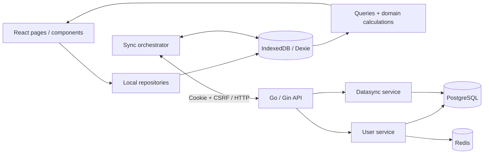

# Vehicle Care — Hệ thống và luồng nghiệp vụ hiện tại

> Đối chiếu trực tiếp working tree ngày 23/09/2026, bao gồm các thay đổi đang dev.
> Đây là mô tả **implementation sau incremental sync A**. Reset dữ liệu dev không được tự động thực hiện; xem runbook ở cuối tài liệu.

## 1. Hệ thống giải quyết bài toán gì?

Ứng dụng giúp một tài khoản quản lý nhiều xe, ghi số kilomet, lần đổ xăng, lần bảo dưỡng, cấu hình chu kỳ bảo dưỡng và xem lịch sử/chi phí. Dữ liệu được đồng bộ giữa các thiết bị cùng tài khoản.

Mô hình chính là **local-first, đồng bộ eventual consistency**:

- UI đọc dữ liệu từ IndexedDB trên thiết bị.
- Thao tác nghiệp vụ ghi local trước, đồng thời tạo mutation trong outbox.
- Sync đẩy mutation lên server rồi kéo thay đổi về; không yêu cầu realtime.
- PostgreSQL giữ trạng thái đã được server chấp nhận và thứ tự thay đổi theo tài khoản.
- Không thể xem dữ liệu vừa lưu local là đã được sao lưu lên server cho đến khi sync thành công.

Khi mở app, client thử xác minh session online. Nếu mất mạng/server lỗi và đã có account cache, người dùng vẫn mở được workspace local. Phản hồi 401 yêu cầu đăng nhập lại; cache không cấp quyền gọi API. Chưa hỗ trợ dùng guest trước lần đăng nhập đầu tiên.

## 2. Các thành phần và trách nhiệm



### Frontend

| Thư mục | Trách nhiệm |
|---|---|
| `client/src/pages`, `components` | Giao diện, nhập liệu, gọi repository |
| `client/src/routes` | Điều hướng và chặn route khi chưa đăng nhập |
| `client/src/domain` | Types và các hàm tính toán/validation thuần |
| `client/src/data/repositories` | Ghi entity + enqueue mutation trong cùng local transaction |
| `client/src/data/queries` | Đọc và tổng hợp dữ liệu cho UI |
| `client/src/hooks` | Kết nối React với live queries của Dexie |
| `client/src/data/db.ts` | Schema IndexedDB và migration local |
| `client/src/data/outbox.ts` | Hàng đợi mutation và trạng thái xử lý |
| `client/src/sync` | Bootstrap, push, pull, áp dụng snapshot, auto-sync |
| `client/src/api` | HTTP client, DTO, lỗi API |
| `client/src/stores` | Trạng thái session/sync của UI; không phải nơi giữ toàn bộ entity |

### Backend

| Thư mục | Trách nhiệm |
|---|---|
| `server/cmd/api` | Đọc config, lắp dependency, chạy HTTP server, graceful shutdown |
| `server/cmd/migrate` | Chạy migration riêng |
| `server/internal/application/user` | Signup/login, session, token, đăng ký thiết bị |
| `server/internal/application/datasync` | Validate và điều phối push/pull |
| `server/internal/domain` | Mô hình dữ liệu dùng giữa application và adapters |
| `server/internal/adapters/httpapi` | Gin routes, cookie, CSRF, CORS, HTTP errors |
| `server/internal/adapters/postgres` | Transaction, entity persistence, sequence, changefeed, dedupe |
| `server/internal/adapters/redis` | Session, token và OAuth-state storage |
| `server/internal/platform` | Config và logging |
| `server/db/queries`, `db/migrations` | SQL nguồn và schema; sqlc sinh code trong adapter |

Port hiện được đặt tại `application/user/port.go` và `application/datasync/port.go`; không có tầng `internal/ports` như một số tài liệu cũ mô tả. `Datasource` tại composition root ghép Postgres và Redis để cung cấp dependency cho application.

## 3. Mô hình dữ liệu nghiệp vụ

| Entity | Phạm vi | Hành vi thực tế |
|---|---|---|
| Account | Một người dùng | Email/password hash, tên, timezone, email verification |
| Device | Theo account | Định danh installation để đăng ký và dedupe push |
| Vehicle | Theo account | Sửa tên/biển số/ngưỡng cảnh báo; archive/restore; tombstone khi xóa |
| PartType | Theo account | Danh mục phụ tùng riêng; thêm/sửa/tắt; seed 10 dòng lúc signup |
| ReminderConfig | Theo xe và phụ tùng | Chu kỳ KM/ngày, mốc ban đầu, enabled, tombstone |
| OdometerLog | Theo xe | **Append-only**; chỉ tạo, không sửa/xóa |
| FuelLog | Theo xe | **Mutable**; sửa/xóa mềm, có thể liên kết OdometerLog |
| ServiceLog | Theo xe và phụ tùng | **Mutable**; sửa/xóa mềm; dùng để suy ra mốc bảo dưỡng |

FuelLog và ServiceLog đã cho sửa/xóa, khác quyết định append-only ở tài liệu MVP ban đầu. Các entity mutable sync bằng snapshot toàn bản ghi, không phải patch từng field.

Các dữ liệu suy ra, không lưu như một nguồn sự thật thứ hai:

- KM hiện tại: suy ra từ OdometerLog.
- Lần bảo dưỡng gần nhất: suy ra từ ServiceLog chưa xóa của xe/phụ tùng.
- Trạng thái nhắc bảo dưỡng: tính từ chu kỳ, mốc ban đầu, log và thời gian hiện tại.
- Chi phí: tổng hợp FuelLog/ServiceLog.

Một cặp `(account, vehicle, part type)` chỉ có một ReminderConfig chưa tombstone. `enabled=false` vẫn chiếm cặp này; “active” trong unique constraint có nghĩa là **chưa xóa**, không phải đang bật.
ReminderConfig dùng UUID xác định từ account, vehicle và PartType, vì vậy hai thiết bị tạo cùng scope offline sẽ dùng cùng ID; unique index phía server vẫn là lớp bảo vệ cuối.

## 4. Đăng ký, đăng nhập và khởi động app

### 4.1. Đăng ký

1. Client gửi email/password/name tới `POST /auth/signup`.
2. Server validate, chuẩn hóa email, hash password bằng bcrypt.
3. Một PostgreSQL transaction tạo account, dòng account sequence và 10 PartType riêng cho account.
4. Server tạo verification token và session trong Redis.
5. HTTP response đặt cookie `sid` (HttpOnly) và `csrf_token` (JS đọc được).
6. Client xác định account qua session và lấy danh mục phụ tùng để dùng trong picker.

Các bước PostgreSQL và Redis không nằm trong một distributed transaction. Nếu tạo session/token lỗi sau khi tạo account, account vẫn đã tồn tại.

Verification/reset token có storage nhưng chưa có luồng gửi email thật. Signup đã tạo phiên đăng nhập ngay, không chờ xác minh email. Google sign-in chưa implement.

### 4.2. Đăng nhập và mở lại app

- Login xác thực password, tạo session/CSRF token rồi đặt cookie.
- `App.tsx` gọi `hydrate()` → `GET /auth/session`.
- Thành công: cập nhật Zustand session và khởi động auto-sync; PartType được tải qua changefeed.
- Lỗi mạng/server không phải 401: mở cached account nếu có, nếu không mới chuyển về sign-in.
- 401/session expired: yêu cầu đăng nhập lại, không xóa các entity/outbox local.
- `accountCache` được lưu khi bootstrap sync thành công và dùng làm fallback offline.

Logout gọi API xóa session rồi xóa account cache và clear session UI. Nếu API lỗi, client vẫn clear local session. Các entity/outbox trong IndexedDB không bị xóa bởi thao tác này.

## 5. Luồng nghiệp vụ trên thiết bị

### 5.1. Thêm, sửa, ẩn và xóa xe

1. Người dùng nhập tên và biển số tùy chọn.
2. Repository sinh UUID, tạo Vehicle với `serverSeq=null`.
3. Transaction Dexie ghi Vehicle và outbox mutation `create`.
4. Live query cập nhật giao diện ngay.
5. Sửa xe tạo snapshot mới và mutation `update` trong cùng transaction.

`archivedAt` ẩn xe và có thể restore. `deletedAt` là tombstone. Xóa xe không tự xóa vật lý các log/reminder con; những query kiểm tra xe đã xóa sẽ ẩn dữ liệu tương ứng.

### 5.2. Danh mục phụ tùng

- Mỗi account có UUID PartType riêng, không dùng UUID chung cho tất cả người dùng.
- Seed mặc định được cấp `server_seq` và append vào changefeed ngay trong transaction signup.
- Client nhận seed bằng pull từ cursor `0`, cùng pipeline với các entity khác.
- Những thay đổi PartType sau đó đi qua push/pull như entity mutable khác.
- Custom PartType có `code` bằng ID; seed PartType dùng code như `engine_oil`.
- PartType inactive không được chọn cho reminder/service mới. Update giữ nguyên reference cũ có thể được chấp nhận dù phụ tùng đã inactive.
- Server vẫn chấp nhận record offline tham chiếu PartType thuộc account nhưng đã bị thiết bị khác tắt sau lúc record được tạo.

Không có đường replication catalog riêng. `GET /part-types` còn là API đọc phụ trợ, không được gọi để bootstrap client.

### 5.3. Cấu hình nhắc bảo dưỡng

1. Chọn xe và PartType active.
2. Nhập ít nhất một chu kỳ: KM hoặc số ngày.
3. Nhập mốc KM/ngày ban đầu để dùng khi chưa có lịch sử bảo dưỡng tương ứng.
4. Repository kiểm tra ownership, phụ tùng và trùng cấu hình.
5. Ghi ReminderConfig + outbox trong một transaction.

Implementation cho phép baseline null; khi không đủ mốc tính toán, domain có thể trả `insufficient_data`. Không có một field mutable “lần thay gần nhất” trong ReminderConfig.

### 5.4. Ghi KM

Mỗi lần nhập tạo một OdometerLog mới. Cho phép KM thấp hơn hiện tại, với cảnh báo ở luồng nhập liệu; không nội suy KM giữa các log.

Cách chọn KM hiện tại trong code:

1. Chọn `recordedAt` mới nhất.
2. Nếu bằng nhau và cả hai có `receivedAtServer`, chọn timestamp nhận mới hơn.
3. Nếu chỉ một log đã sync, log đã sync được ưu tiên.
4. Nếu cả hai chưa sync, dùng thứ tự phần tử đầu vào.

Điểm 2–4 chưa phải total ordering bền vững: UUID không biểu diễn thứ tự tạo; đề xuất chuyển tie-break sang `serverSeq`/local sequence nằm trong bản review.

### 5.5. Ghi đổ xăng

- Có thể nhập thời gian, lượng xăng, tiền, nơi đổ, ghi chú, đầy bình và KM tùy chọn.
- Không nhập KM: tạo một FuelLog và một mutation.
- Có nhập KM: tạo OdometerLog trước, FuelLog tham chiếu ID đó, rồi ghi **hai entity + hai mutation trong cùng local transaction**.
- Server vẫn áp dụng từng mutation bằng transaction riêng, nên cặp Fuel/Odometer không atomic trên server.
- Sửa/xóa FuelLog không sửa/xóa OdometerLog đã tạo kèm. Đổi thời gian FuelLog cũng không tự đổi `recordedAt` của OdometerLog.

### 5.6. Ghi bảo dưỡng

1. Chọn xe/phụ tùng, thời gian, KM snapshot, chi phí và ghi chú.
2. Tạo ServiceLog + mutation.
3. Query reminder lấy lại ServiceLog mới nhất và tính lại mốc bảo dưỡng.
4. Không update ReminderConfig để reset chu kỳ.

KM snapshot trên ServiceLog không tạo thêm OdometerLog. Sửa/xóa ServiceLog có thể thay đổi mốc reminder; xóa bản mới nhất có thể làm bản cũ hơn trở thành mốc được dùng.

### 5.7. Tính trạng thái reminder

Hàm thuần: `client/src/domain/reminder.ts::calculateReminderStatus`.

```text
baselineKm   = KM của service mới nhất nếu có, nếu không lấy baseline config
baselineDate = ngày service mới nhất theo timezone account, nếu không lấy baseline config
usedKm       = max(0, currentKm - baselineKm)
usedDays     = max(0, khoảng cách ngày lịch từ baselineDate đến hôm nay)
remaining    = interval - used
```

Thứ tự quyết định:

1. Mọi điều kiện đã cấu hình đều thiếu dữ liệu → `insufficient_data`.
2. Có ít nhất một điều kiện `remaining <= 0` → `overdue`.
3. Có ít nhất một điều kiện `used / interval >= dueSoonRatio` → `due_soon`.
4. Còn lại → `not_due`.

Mặc định `dueSoonRatio=0.9`: đã dùng 90%, tức còn 10% chu kỳ. Xe có thể override ngưỡng. Đây là **tỷ lệ đã dùng**, dù tên constant hiện tại là `DUE_SOON_REMAINING_RATIO`. Một chiều thiếu dữ liệu không ngăn đánh giá chiều còn lại.

Nếu service mới nhất không có KM, chiều KM fallback về baseline config, không tìm service cũ gần nhất có KM. Đây là hành vi hiện tại cần chốt lại về nghiệp vụ.

Tính ngày theo timezone account. Hook refresh mỗi phút và khi đổi trạng thái foreground/background, ngoài việc theo dõi dữ liệu qua live query.

### 5.8. Lịch sử và chi phí

- History gộp FuelLog và ServiceLog chưa xóa, sort theo thời điểm nghiệp vụ.
- Chi phí tháng nhóm theo tháng lịch trong timezone account.
- Chi phí/KM tham khảo dùng log trong cửa sổ gần đây và chênh lệch `max(KM)-min(KM)`.
- Cả History, chi phí tháng và cost/KM đều lọc FuelLog/ServiceLog có `deletedAt`.

## 6. Vòng đời một lần sync

### 6.1. Khi nào chạy?

- Người dùng bấm đồng bộ thủ công.
- Auto-sync kiểm tra lúc khởi động, thay đổi session, trở lại foreground hoặc có mạng.
- Chỉ chạy tự động khi authenticated, online, tab visible và lần thành công gần nhất cách hơn 15 phút.
- Có timer để kiểm tra lại khi tab vẫn mở; không push ngay sau mỗi thao tác local.
- `inFlight` gộp lời gọi trong một tab; Web Locks serialize sync/restore giữa các tab theo account. Runtime không hỗ trợ Web Locks chỉ có fallback trong process, không bảo đảm multi-tab.
- Lỗi thật cần thao tác retry/repair/restore. Hoãn pull vì có edit local mới là `pending`, không ghi `lastSyncError` và không ngăn các lượt auto-sync tiếp theo.

### 6.2. Trình tự tổng quát

```mermaid
sequenceDiagram
    participant S as Sync orchestrator
    participant L as IndexedDB
    participant A as API
    participant P as PostgreSQL
    S->>L: Đọc/tạo syncMeta theo account
    S->>A: POST /devices/register
    loop FIFO tới localSeq đã chốt đầu lượt
        S->>L: Đọc item đầu queue theo localSeq
        S->>A: POST /sync/push
        loop Từng mutation theo thứ tự request
            A->>P: Lock account, dedupe, validate và apply transaction
            P-->>A: Kết quả từng mutation
        end
        A-->>S: Một result cho mutation
        S->>L: Ghi acknowledgment/trạng thái outbox
    end
    Note over S,L: Chỉ pull khi push thành công và queue sạch; nếu có edit mới thì hoãn
    loop Các trang cùng until_seq
        S->>A: GET /sync/pull?after_seq=cursor&until_seq=bound
        A->>P: Đọc changefeed tới upper bound
        P-->>A: changes
        A-->>S: changes, next_cursor, until_seq, has_more
        S->>L: Transaction: queue sạch → apply changes + cập nhật cursor
    end
    S->>L: Kiểm tra còn unresolved không
    S->>L: Thành công thì cập nhật lastSyncedAt
```

### 6.3. Định danh và metadata

| Field | Ý nghĩa |
|---|---|
| `entityId` | UUID ổn định của bản ghi |
| `mutationId` | UUID của một thao tác cần gửi; khác entity ID |
| `deviceId` | ID khởi tạo từ localStorage/fallback, sau đó cố định trong syncMeta của workspace IndexedDB |
| `accountId` | Phạm vi dữ liệu; server lấy account từ session |
| `serverSeq` | Phiên bản/thứ tự server của một thay đổi trong account |
| `lastSeenSeq` | Cursor local đã áp dụng từ pull, lưu theo account |
| `localSeq` | Thứ tự FIFO của mutation trong thiết bị |
| `receivedAtServer` | Timestamp server gắn cho thay đổi; không phải cursor |

ACK push cập nhật `serverSeq` của entity, **không nhảy `lastSeenSeq`**. Cursor pull chỉ tăng khi page được commit local, để không bỏ qua thay đổi từ thiết bị khác.

ACK không chứa business fields canonical. Pull vẫn áp dụng payload khi sequence bằng ACK, bao gồm OdometerLog, để nhận giá trị đã chuẩn hóa/làm tròn từ PostgreSQL. Change có sequence thấp hơn local bị bỏ qua.

### 6.4. Push phía client

1. Đọc item đầu tiên theo `accountId + localSeq`.
2. Nếu item là `blocked`, dừng và yêu cầu repair hoặc restore.
3. Gửi một mutation với đúng payload/operation/mutation ID đã enqueue.
4. ACK `applied`/`duplicate` thì xóa item khỏi outbox và cập nhật metadata entity.
5. `retryable_error` giữ item ở `pending` và dừng lượt sync; `rejected` chuyển thành `blocked` và dừng lượt sync.
6. Không tự retry terminal mutation, không coalesce và không gửi các item phía sau item lỗi.

### 6.5. Push phía server

Application kiểm tra API version, device, batch size và payload. Adapter thực hiện ownership/reference validation phụ thuộc DB sau dedupe, bên trong transaction:

```text
BEGIN
  lock dòng account_sequences trước khi lookup mutation
  kiểm tra processed_mutations(account, device, mutation)
  nếu đã xử lý: trả acknowledgment cũ dưới dạng duplicate
  validate ownership/references cho mutation mới
  kiểm tra trùng scope reminder khi cần
  mutable: lock bản hiện tại; cấp seq; upsert
  odometer: dedupe theo entity ID; nếu mới thì cấp seq và insert
  append change_feed
  lưu processed_mutations
COMMIT
```

Entity update, cấp seq, append feed và lưu acknowledgment của mutation được chấp nhận nằm trong cùng transaction. `account_sequences` cập nhật theo row lock; nhiều account có sequence độc lập. Một HTTP batch có thể thành công một phần.

Mutable dùng **last server-applied write wins**, tức snapshot xử lý sau thắng toàn bản ghi. Không dùng timestamp client hoặc optimistic conflict status. Đây không phải field-level merge hay CRDT; nếu hai thiết bị cùng sửa offline, mutation được server xử lý sau sẽ thắng.

### 6.6. Pull phía server và client

1. Request đầu không có `until_seq`: server đọc current account sequence làm upper bound.
2. Query `after_seq < server_seq <= until_seq`, tăng dần, đọc `limit+1` để xác định `has_more`.
3. Request sau gửi lại cùng `until_seq`; thay đổi mới sau bound đợi lượt sync kế tiếp.
4. Trước khi apply page, transaction Dexie kiểm tra outbox account vẫn sạch.
5. Nếu có local mutation mới, không ghi page/cursor và trả `deferred`; orchestrator kết thúc ở `pending`, không lưu lỗi retryable.
6. Nếu queue sạch, apply page và cursor trong cùng transaction.

Feed dùng canonical payload từ row đã lưu. Pull bình thường không apply khi outbox còn `pending` hoặc `blocked`, nên không ghi đè local edit chưa được xử lý.

### 6.7. Kết quả và retry

| Kết quả | Client hiện xử lý |
|---|---|
| `applied` | Xóa mutation đã ACK; cập nhật metadata nếu không có local revision mới hơn |
| `duplicate` | Hoàn tất mutation; ACK cũ không làm lùi version, không bị coi là lỗi |
| `rejected` | Chuyển row thành `blocked`, hiển thị nguyên nhân và action repair/restore |
| `retryable_error` | Giữ `pending`, tăng retryCount; chỉ retry khi người dùng bấm Thử lại |
| HTTP/network error | Giữ `pending`, lưu lỗi retryable; không auto-retry |
| Có edit local mới trong lượt sync | Giữ `pending`, hoãn pull, không tăng cursor/lastSyncedAt, không lưu lỗi |

Pull chỉ chạy sau khi push hết queue. Chỉ hiển thị “Đã đồng bộ” khi không còn `pending` hoặc `blocked`, bootstrap đã ready và pull hoàn tất. Mutation terminal không tự retry nguyên payload; người dùng có thể sửa thành mutation ID mới hoặc khôi phục toàn bộ workspace từ server. Sync và restore dùng cùng khóa theo account. Restore chặn local write, xóa thay đổi local chưa sync, reset cursor và pull lại từ `0`; nếu lỗi giữa chừng, trạng thái `restore_failed` và cursor đã commit được giữ để tiếp tục mà không xóa lại dữ liệu vừa tải.

Onboarding cũng hiển thị sync/recovery: người dùng không phải tạo thêm xe chỉ để truy cập retry hoặc restore khi bootstrap lỗi. Nút recovery riêng cạnh sync cho phép mở restore cả khi lỗi pull chỉ được phân loại retryable; không cần chờ một mutation bị blocked. Có thể sửa blocked payload khi offline, còn restore cần online và xác nhận bỏ thay đổi chưa sync. Repair hiện dùng editor JSON; sửa bằng form entity thông thường không tự thay thế mutation blocked cũ.

## 7. Những gì đã có và chưa hoàn chỉnh

**Đã có:** local transaction + outbox, phân trang pull, account-scoped sequence, dedupe mutation, tombstone, cookie/CSRF, PWA app-shell cache, health endpoints, migration và các unit/adapter tests.

**Chưa hoàn chỉnh:** guest-to-account merge, email delivery/notification worker, Google OAuth, export/import. Cold-start offline, FIFO/blocked recovery, pull upper bound và bootstrap một pipeline đã được triển khai trong đợt này.

`notification_deliveries` hiện chỉ là schema. Chưa có job server tính reminder và gửi email; trạng thái nhắc bảo dưỡng được tính phía client.

## 8. Vận hành và kiểm chứng

```bash
make dev-infra
make migrate-up
make dev
```

Backend dùng PostgreSQL và Redis thật. `AUTO_MIGRATE=true` cho phép API chạy migration trước startup; mặc định tắt. API readiness kiểm tra cả hai dependency.

Các lệnh kiểm tra: `make test`, `make lint`, `make build`, `make test-integration`. Lệnh integration bắt buộc Docker/PostgreSQL thật; thiếu Docker sẽ fail, không skip.

PostgreSQL hiện có baseline `1790121600_baseline` dùng Unix seconds, cùng convention với `migrate create`. Database đã chạy lịch sử cũ (kể cả baseline thử nghiệm `20260923000000`) phải được chủ động reset hoặc dùng database dev mới cùng Redis session và IndexedDB/PWA storage; ứng dụng không tự drop schema. Xem trạng thái kiểm chứng ở [plan](./incremental-sync-plan.md#verification-status).
